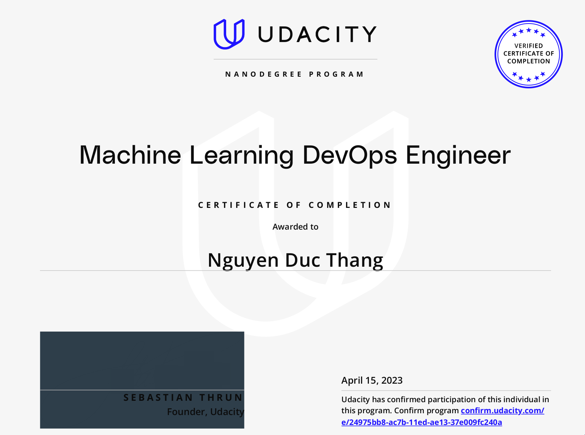

# [MLOps] Machine Learning DevOps Engineer
## Overview
The Machine Learning DevOps Engineer Nanodegree program focuses on the software engineering fundamentals needed to successfully streamline the deployment of data and machine-learning models in a production-level environment. Students will build the DevOps skills required to automate the various aspects and stages of machine learning model building and monitoring over time.
# [My Certificate](confirm.udacity.com/e/24975bb8-ac7b-11ed-ae13-37e009fc240a)
